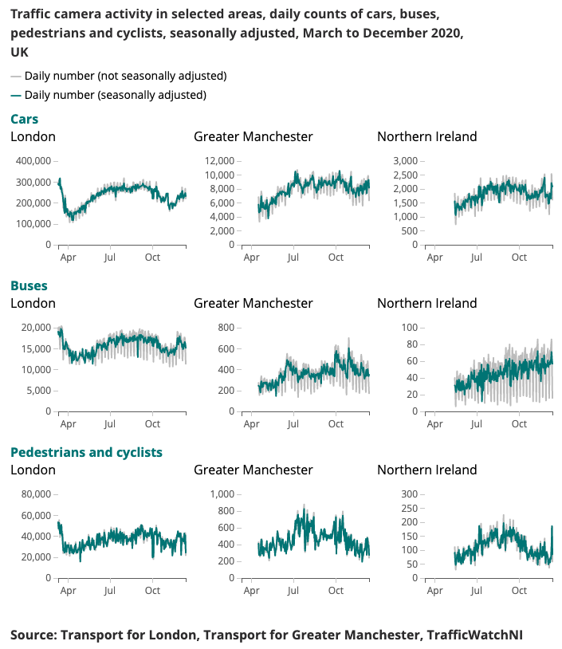
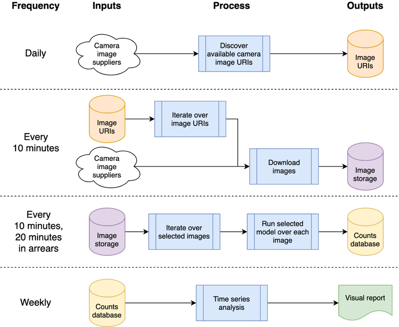
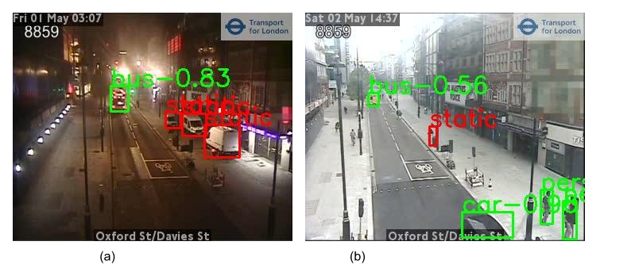

# Chrono Lens

This is the public repository of the Traffic Cameras analysis project as
published on the Office for National Statistics Data Science Campus [Blog](https://datasciencecampus.ons.gov.uk/projects/estimating-vehicle-and-pedestrian-activity-from-town-and-city-traffic-cameras/) as part of the ONS
Coronavirus Faster Indicators (for example - [Traffic Camera Activity - 10th September 2020](https://www.ons.gov.uk/peoplepopulationandcommunity/healthandsocialcare/conditionsanddiseases/bulletins/coronavirustheukeconomyandsocietyfasterindicators/10september2020#traffic-camera-activity)) and
the underlying [methodology](https://www.ons.gov.uk/economy/economicoutputandproductivity/output/methodologies/usingtrafficcameraimagestoderiveanindicatorofbusynessexperimentalresearch).
The project utilised Google Compute Platform (GCP) to enable a scalable solution, but
the underlying methodology is platform agnostic; this repository contains our
GCP orientated implementation.

An example output produced for the Coronavirus Faster Indicator is presented below.

## Project Summary

Understanding changing patterns in mobility and behaviour in real time has been a major focus of the government
response to the coronavirus (COVID-19). The Data Science Campus has been exploring alternative data sources that might
give insights on how to estimate levels of social distancing, and track the upturn of society and the economy as
lockdown conditions are relaxed.

Traffic cameras are a widely and publicly available data source allowing transport professionals and the public to
assess traffic flow in different parts of the country via the internet. The images traffic cameras produce are publicly
available, low resolution, and do not permit people or vehicles to be individually identified. They differ from CCTV
used for public safety and law enforcement for Automatic Number Plate Recognition (ANPR) or for monitoring traffic speed.

## Architecture

This architecture can be mapped to a single machine or a cloud system; we opted to use Google Compute Platform (GCP), but
other platforms such as Amazon Web Services (AWS) or Microsoft’s Azure would provide relatively equivalent services.

The system is hosted as “cloud functions”, which are stand-alone, stateless code that can be called repeatedly without
causing corruption – a key consideration to increase the robustness of the functions. The daily and “every 10 minutes”
processing bursts are orchestrated using GCP’s Scheduler to trigger a GCP Pub/Sub Topic according to the desired
schedule. GCP cloud functions are registered against the topic and are started whenever the topic is triggered.

Processing the images to detect vehicles and pedestrians results in counts of objects being written into a database for
later analysis as a time series. The database is used to share data between the data collection and time series
analysis, reducing coupling. We use BigQuery as our database given its wide support in other GCP products, such as
Data Studio for data visualisation.

## Object Detection

The object detection process identifies both static and moving objects. As we are aiming to detect activity, it is
important to filter out static objects using temporal information. The images are sampled at 10-minute intervals, so
traditional methods for background detection in video, such as mixture of Gaussians, are not suitable.

Any pedestrians and vehicles classified during object detection will be set as static and removed from the final counts
if they also appear in the background. The below image shows example results of the static mask, where the parked cars
in image (a)
are identified as static and removed. An extra benefit is that the static mask can help remove false alarms. For example,
in image (b), the rubbish bin is misidentified as a pedestrian in the object detection but filtered out as static
background.

## Google Compute Platform - Implementation

The GCP related source code is stored in the `cloud` folder; this downloads the imagery, processes it to count objects,
stores the counts in a database and (weekly) produces time-series analysis. All documentation and source code
are stored in the `cloud` folder; refer to the [Cloud README.md](cloud/README.md) for an overview of the architecture
and how to install your own instance using our scripts into your GCP project space. The project can be integrated
into GitHub, enabling auto-deployment and test execution automatically from commits to a local GitHub project; this is
also documented in the [Cloud README.md](cloud/README.md).

## Installation

### Virtual Environments

The creation of a virtual environment is strongly advised allowing for an isolated working environment. Examples of
good working environments include [conda](https://docs.conda.io/projects/conda/en/latest/index.html),
[pyenv](https://github.com/pyenv/pyenv-virtualenv), and [poerty](https://python-poetry.org/).

### Installing Requirements

Note that dependencies
are already contained in `requirements.txt`, so please install this via pip:

`pip install -r requirements.txt`

### Pre-Commit Hooks

To prevent accidentally committing passwords, [pre-commit hooks](https://pre-commit.com/) are recommended that prevent git commits
from being processed before sensitive information has landed in the repository. We've used the pre-commit
hooks from https://github.com/ukgovdatascience/govcookiecutter

Installing requirements.txt will install the pre-commit tool, which now needs to be connected to git:

`pre-commit install`

...which will then pull configuration from `.pre-commit-config.yaml`.

**NOTE** the `check-added-large-files` pre-commit test has its maximum kB size in
`.pre-commit-config.yaml` is temporarily increased to 60Mb when adding the RCNN model file
`cloud/dsc_lib_tests/test_data/test_detector_data/fig_frcnn_rebuscov-3.pb`.
The limit is then reverted to 5Mb as a sensible "normal" upper limit.

#### Pre-Commit First Use

Its recommended to run a sweep across all files before proceeding, just to ensure nothing is already
present by mistake:

`pre-commit run --all-files`

This will report any existing issues - useful as the hook is otherwise only run on edited files.

## Support Scripts

The project is designed to be used primarily via cloud infrastructure, but there are utility scripts for local access
and updates to the time series. These scripts are located in the `scripts` folder, with each script now described in
separate following sections. Further information can be found in [`scripts/README.md`](scripts/README.md),
and their use by an optional virtual machine is described in [`cloud/README.md`](cloud/README.md).

Note that scripts make use of code in the `chrono_lens` folder as well as that in the `cloud/dsc_lib` folder.

### `download_analysis_camera_list.py`

This script downloads the list of camera IDs to be analysed, from the GCP project, and the list
can then be used by `batch_process_images.py`. It accesses the bucket `sources-${PROJECT_ID}`,
looking in the `analyse` folder for JSON files listing cameras to be processed.

Command line options are:
* `--cameras-to-analyse-file` filename of a JSON file to write camera IDs and image sources into
* `--model-config-file` filename of a test file where to store the name of the model in use to analyse the images
* `--JSON-private-key` JSON key from GCP with permission to invoke cloud functions in the named GCP project
named cameras to process
* `--gcp-region` Google Compute Platform region where your project is hosted (e.g. `europe-west2`)
* `--gcp-project` name of your Google Compute Platform project
* `--help` detailed help on each option, with default arguments listed

The service account represented by the JSON file will need:
* `storage/legacyBucketReader` and `storage/legacyObjectReader` on the `sources` bucket

See the [Cloud README.md](cloud/README.md) and [scripts README.md](scripts/README.md) for further information;
the Cloud setup scripts will create a service account with these permissions (`backfill-ne@...`).

### `batch_process_images.py`

This script is useful in running the time series on pre-existing data - for example, if you have started image
acquisition before readying the model, or if you wish to re-process imagery with an alternative model or
alternative settings.

The script calls the cloud function `process_day` which runs a named model on a particular date for a given
list of cameras. `process_day` in turn calls `run_model_on_image` in the same way the scheduled every 10 minute
call is processed, with results placed in BigQuery.

Command line options are:
* `--JSON-private-key` JSON key from GCP with permission to invoke cloud functions in the named GCP project
* `--cameras-json` filename of a JSON file containing a dictionary of image suppliers, each key linked to a list of
named cameras to process
* `--start-date` starting date for when images will be processed
* `--end-date` end date for when images will be processed
* `--model-name` name of the machine learning model with optional pre- and post-processing filters (available
models are listed with `--help`)
* `--gcp-region` Google Compute Platform region where your project is hosted (e.g. `europe-west2`)
* `--gcp-project` name of your Google Compute Platform project
* `--help` detailed help on each option, with default arguments listed

The service account represented by the JSON file will need:
* `roles/cloudfunctions.invoker`

See the [Cloud README.md](cloud/README.md) and [scripts README.md](scripts/README.md) for further information;
the Cloud setup scripts will create a service account with these permissions (`backfill-ne@...`).

### `backfill_NEtraveldata.py`

The system pulls images every 10 minutes, but the NE Travel Data hosted c/o Newcastle University's
[Urban Observatory](https://urbanobservatory.ac.uk/) may arrive several hours later in batches. Hence this script
(and a variation used in the GCP virtual machine) back-fills any late arriving data; once data has been filled,
then deletes any rows from NETravelData marked as `missing` or `faulty`, and then re-process the affected
date range using the cloud function `process_day`.

The script takes a JSON file as reported by Newcastle's server which lists available cameras; these cameras are then
requested and uploaded to the Google storage bucket for later processing; BiqQuery table entries
for this date range will also have any NE Travel Data processed image records removed if they
are flagged as `Faulty` or `Missing` (so `batch_process_images.py` will then re-process the gaps).

**Note** that a service account is needed to execute this script, with the following permissions:
* `roles/bigquery.dataViewer`
* `roles/bigquery.jobUser`
* `roles/bigquery.dataEditor`
* `roles/cloudfunctions.invoker`
* `storage.legacyObjectReader` and `storage.legacyBucketWriter` permissions on the `data` bucket
* `storage/legacyBucketReader` and `storage/legacyObjectReader` on the `sources` bucket

See the [Cloud README.md](cloud/README.md) and [scripts README.md](scripts/README.md) for further information;
the Cloud setup scripts will create a service account with these permissions (`backfill-ne@...`).

Command line options are:
* `--JSON-private-key` JSON key for GCP service account with appropriate permissions (see above)
* `--ne-travel-sources-json` JSON file containing NE Travel Data sources as downloaded from Urban Observatory
(example provided in `NEtraveldata_cctv.json`)
* `--start-date` starting date for when images will be processed
* `--end-date` end date for when images will be processed
* `--model-name` name of the machine learning model with optional pre- and post-processing filters (available
models are listed with `--help`)
* `--gcp-region` Google Compute Platform region where your project is hosted (e.g. `europe-west2`)
* `--gcp-project` name of your Google Compute Platform project
* `--help` detailed help on each option, with default arguments listed

### `remove_old_images.py`

Once images are analysed, they do not need to be retained (unless you are modifying the model or filtering)
and can be removed. In case of system issues, the images can be retained on a rolling deletion basis - this
script is used in the optional virtual machine (see [`cloud/README.md`](cloud/README.md)) to remove images
older than 28 days (4 weeks).

Command line options are:
* `--maximum-number-of-days` maximum number of days an image is retained before it is deleted (date folder is
used to determine when it was created - so if an image was downloaded today but the folder indicated 60 days ago,
running the script with less than 60 days specified will remove the image)
* `--JSON-private-key` JSON key from GCP with permission to invoke cloud functions in the named GCP project
* `--gcp-region` Google Compute Platform region where your project is hosted (e.g. `europe-west2`)
* `--gcp-project` name of your Google Compute Platform project
* `--help` detailed help on each option, with default arguments listed

The service account represented by the JSON file will need:
* `storage.legacyObjectReader` and `storage.legacyBucketWriter` permissions on the `data` bucket
* `storage/legacyBucketReader` and `storage/legacyObjectReader` on the `sources` bucket

See the [Cloud README.md](cloud/README.md) and [scripts README.md](scripts/README.md) for further information;
the Cloud setup scripts will create a service account with these permissions (`backfill-ne@...`).

## Release

Version | Date | Notes
-|-|-
1.0.0 | 2021-06-08 | First release of public repository

## Future Work

Areas of potential future work are presented here; these changes may not be investigated, but are here
to make people aware of potential improvements we have considered.

### Infrastructure as Code

At present, bash shell scripts are used to create the infrastructure; an improvement would be to use IaC,
such as Terraform. This simplifies the changing of (e.g.) Cloud Function configurations
without having to manually remove the Cloud Build Trigger and re-creating it when
the runtime environment or memory limits are changed.

### Ingest Only What You Need

The current design stems from its initial use case of acquiring images before the models were
finalised, hence all available images are downloaded rather than just those that are
analysed. To save ingestion costs, the ingest code should cross-check against
the analysis JSON files and only download those files; an alert should be raised
when any of these sources are no longer available, or if new sources become available.

### Removal of 10-Minute Interval NETravelData Download

The nightly back-fill of images for NETravelData appears to refresh around 40% of NETravelData images;
the advantage of a regular refresh is diminished if the numbers are only required daily,
and hence the Cloud Function `distribute_ne_travel_data` may be removed.

### Move Away from `http async` to PubSub

The initial design uses manually operated scripts when testing new models - namely, `batch_process_images.py`.
This reports the success (or not) and numbers of images processed. To do this,
a Cloud Function works well as it returns a result. However, a more efficient
architecture would be to use a PubSub queue internally with the `distribute_json_sources` and
`processed_scheduled` functions adding work to PubSub queues which are consumed by a single worker
function, rather than the current hierarchy of async calls (using two extra functions to scale out).

# Acknowledgements

## RCNN Model

Newcastle University's [Urban Observatory](https://urbanobservatory.ac.uk/) supplied the
[pre-trained Faster-RCNNN](https://github.com/TomKomar/uo-object_counting/raw/26c9f29b46ba7afa6294934ab8326fd4d5f3418d/app/fig_frcnn_rebuscov-3.pb)
which we use (a local copy is stored in [`cloud/dsc_lib_tests/test_data/test_detector_data/fig_frcnn_rebuscov-3.pb`](cloud/dsc_lib_tests/test_data/test_detector_data)).

## Open Traffic Camera Imagery

### North East

Data is provided by the [North East Urban Traffic Management and Control Open Data Service](https://www.netraveldata.co.uk/?page_id=13),
 licensed under the [Open Government Licence 3.0](http://www.nationalarchives.gov.uk/doc/open-government-licence/version/3/).
Images are attributed to Tyne and Wear Urban Traffic Management and Control.

The North East data is further processed and hosted by Newcastle University's [Urban Observatory](https://urbanobservatory.ac.uk/),
whose support and advice we gratefully acknowledge.

### Transport for London (TfL)

Data is provided by [TfL](https://www.tfljamcams.net/) and is powered by TfL Open Data. The data is licensed under version 2.0 of the
[Open Government Licence](http://www.nationalarchives.gov.uk/doc/open-government-licence/version/2/). TfL data
contains OS data © Crown copyright and database rights 2016 and Geomni UK Map data © and database rights (2019).

## 3rd Party Library Usage

Various 3rd party libraries are used in this project; these are listed
on the [dependencies](https://github.com/datasciencecampus/chrono_lens/network/dependencies) page, whose contributions
we gratefully acknowledge.
