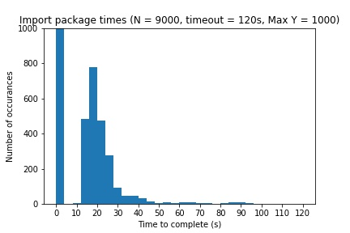
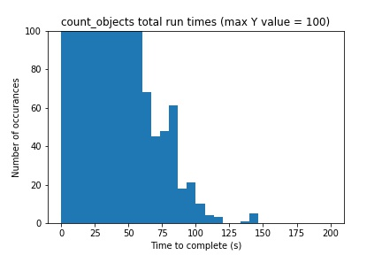
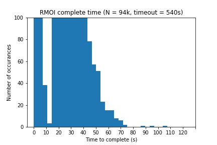
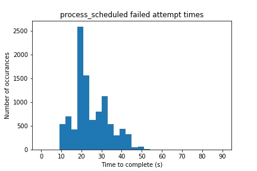
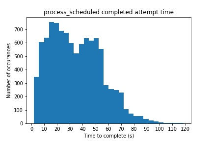

# Cloud functions timeout and load timeout

We identified 'load timeouts' occurring associated with the following function
hierarchy tree:

`process_scheduled` <-- `run_model_on_image` <-- `count_objects`

Below we outline the rationale behind calculating appropriate timeouts for all the above functions.

## `count_objects`

 Frequently `count_objects` function execution started and later timed out
 after 60s, denoted by the status 'load timeout' in the log `textPayload`. It was found that
 package imports associated with tensorflow were the cause of the `count_objects` function execution
 taking up to 95s, causing timeouts. Figure 1 illustrates the large tail in the total
 package import times. Another observation was that the 'load_timeout' status changed
 to 'timeout' when the package imports were moved to within the count objects cloud
 function. Furthermore updating from tensorflow 1.15.4 to tensorflow 2.3.0 had no measurable impact
 on package import times.

 Figure 1. `count_objects` cloud function total package import times.
 

 > `Load timeout` indicates that a cold start function was terminated during initialisation (loading) before its named Python function was called. This is caused be global scope code being executed before the function itself can then be called.

To adjust for prolonged `count_objects` import times needed to set an appropriate function
timeout time. Plotting a histogram of sample `count_objects` total runtimes we see no
execution taking longer than ~145s (Figure 2). Therefore a sensible runtime of 180s is suggested.

Figure 2. `count_objects` cloud function total execution time (N = ~180,000).

## `run_model_on_image`

We observed timeouts relating to the `run_model_on_image` cloud function. The `run_model_on_image`
'normal' total execution time ranges between 0.1s-60s (Figure 3). However its common for `run_model_on_image`
total execution times to extend up to several minutes given a combination of multiple
'failed attempts'. A combination of failed attempts is shown in Table 1.

Figure 3. `run_model_on_image` total execution times.

Table 1. `run_model_on_image` failed attempts frequency from 4th November - 23rd November.

| Failed attempt  | number of occurrences |
|-------------|-----------------------|
| Failed attempt#0  | 24,809 |
| Failed attempt#1  | 329 |
| Failed attempt#2  | 7 |
| Failed attempt#3  | 1 |
| Failed attempt#4  | 0 |
| Failed attempt#5  | 0 |

### Calculating an appropriate `run_model_on_image` timeout

Given that `run_model_on_image` succeeds before 4 retries, we've designed the timeout to cope with a worst case of 3 retries, 3 periods of sleep, and a single completed attempt, all with maximum length time taken.
Between each failed attempt and subsequent retry there is a 16s to 32s sleep time.

1. We know that failed attempts take approximately 11s to complete.
1. We know that completed attempts take approximately 23s to complete.
1. Sleep times max out at 32s.

Reviewing the frequency of failed 'Failed attempts', we know that we reach 'Failed attempt#2'
7 times every 225,000 executions. Therefore we need the timeout to accommodate 3 failed
attempts, 3 periods of sleep, and 1 completed execution.

(11s * 3) + (32s * 3) + 23s = 152s

Considering a buffer, 152s timeout should increase to 180s.

## `process_scheduled`

Avoiding timeouts for `process_scheduled` is paramount. Calculating an appropriate timeout time
for `process_scheduled` follows the same arithmetic logic as the `run_model_on_image` timeout.
The frequency failed attempts for `process_scheduled` is shown in Table 2.

Table 2.  `process_scheduled` failed attempts frequency from 4th November - 23rd November.

| Failed attempt  | number of occurrences |
|-------------|-----------------------|
| Failed attempt#0  | 1,379 |
| Failed attempt#1  | 1463 |
| Failed attempt#2  | 32 |
| Failed attempt#3  | 0 |
| Failed attempt#4  | 0 |
| Failed attempt#5  | 0 |

### Calculating an appropriate `process_scheduled` timeout

We've designed the timeout to cope with 3 retries, 3 periods of sleeps, and a single completed attempt.
Again, between each failed attempt and subsequent retry there is a 16s to 32s sleep time.

1. We know that failed attempts upper bound is approximately 55s (Figure 4).
1. We know that completed attempts upper bound is approximately 120s (Figure 5).
1. Sleep times max out at 32s.

(55s * 3) + (32s*3) + 120s = 381s

Figure 4. `process_scheduled` failed attempt times.

Figure 5. `process_scheduled` failed attempt times.

Considering a buffer, 381s timeout should increase to 420s.
