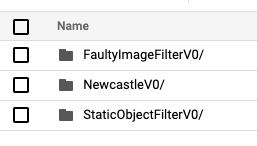
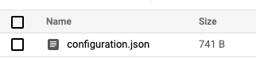
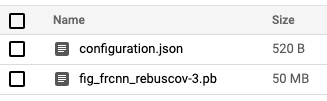
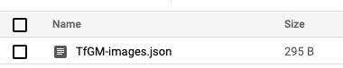

# Identifying Objects in Traffic Cameras

This project aims to examine public traffic camera feeds,
build vision models that can detect objects in these feeds,
and to store the object counts for further analysis such as
trending over time. Camera data is stored in the short term
to enable models to be trained, and to support late data arrival.
Once processed, the camera data no longer needs to be stored unless alternative models are required to be
trialled later.

**NOTE:** We cannot guarantee the security of any infrastructure this project generates; it is
designed to keep all resources private at the time of writing, but APIs and default settings
change over time. You are **strongly encouraged** to review anything generated by this open repository;
an accidentally open cloud project could incur unexpected financial costs (caused by a malicious 3rd party
or otherwise).

**NOTE:** At the time of writing (03-02-2021), running this project costs approximately £350/month to run in
the UK; please be aware of **potential costs** and check your usage regularly. Do not manually start the VM
and leave it idling, remember to switch it off. When the VM auto-starts via the cloud function `start_vm`,
(daily at 3am) it should switch off once its script has completed to save costs. If a human starts the VM manually,
this will prevent the auto-start from switching the VM off.

This document consists of four sections:
1. [Design and architecture of solution to object identification](#design-and-architecture-of-solution-to-object-identification)
1. [Creating Google Cloud Platform (GCP) Infrastructure](#creating-google-cloud-platform-gcp-infrastructure)
1. [Merging `develop` to `main` in CI-CD](#merging-develop-to-main-in-ci-cd)
1. [Adding new Cloud Functions](#adding-new-cloud-functions)

# Design and architecture of solution to object identification
The object identification is experimental, and hence needs to be re-evaluated
multiple times across the same dataset. With this in mind, rather than
streaming data through a model to generate results, we instead collect the
data in bucket storage for later processing (and potentially re-processing
with a refined model). This creates the following requirements:

1. Discover available image sources
1. Update image sources regularly (e.g. daily)
1. Download all images at regular intervals and store for later processing

Note that storage can eventually by replaced with a live stream to a model, once
a model is refined and stable.

Once imagery is downloaded, we can then process. There are two scenarios:

1. Run a specified model over historical data, or
1. Run a specified model over newly received data

Finally, images can be deleted once no longer required.

## Discovering available image sources
This is initiated by manually looking for public sources of data,
as we are focused on a publicly available and reusable solution.
If you are using your own data, this step is simply to determine
what data you have and where it is stored - assuming you will follow this workflow
and upload your data to google cloud to be processed.

The result of this phase is a JSON file per camera provider
(e.g. Transport for London (TfL), North East Travel Information),
which is stored in a `sources` bucket. For instance, TfL cameras
sources would be stored in `sources_TfL.json`, which is a list
of image URLs.

Note that the `sources` bucket is actually named `sources-<projectname>`
so it has a globally unique bucket name as required by Google - and
this will also include the name of the related GitHub branch as
a postfix (see the section on
[Creating Google Cloud Platfom (GCP) Infrastructure](#creating-google-cloud-platform-gcp-infrastructure)).

## Updating image sources

Given suppliers of publicly available cameras often provide API
endpoints on the web, we have a cloud function that calls these
once a day to update the list of camera images we should
download. This is the `update_sources` cloud function,
which generates a JSON file describing each available camera
and its image URL where it can be downloaded.

Google Cloud Scheduler is used, with a trigger set for 3am every day.
This in turn is registered with Google PubSub, and a topic is
associated with this (`scheduled-daily-3am`). This topic is
then subscribed to as a trigger by `update_surces` and `start_vm`, so the two functions
are called daily at 3am.

Other suppliers may not provide such an endpoint, in which case
this function is not needed.

## Download all images at regular intervals

Simply put, the cloud functions are triggered to run at regular
intervals and request each image listed in the JSON files
stored in the `sources` bucket. Each image is stored in
the `data` bucket, using the naming convention
`<camera supplier>/<date as YYYYMMDD>/<time HHMM>/<camera ID>.<format>`.
* "Camera supplier" is the name of the JSON file (without the `.json` extension)
* Date and time are when the request was triggered - not when the
image was actually captured
  * Hence the date/time may be up to 10 minutes out
  * However, this ensures a consistent, simplified folder structure
  * Actual capture date/time may be stored in JPEG metadata,
    depending on supplier
* Camera ID is the base name of the source image file - which
  we assume is a unique ID for that supplier's camera
* File extension is as originally provided - it may be JPEG,
or it something else; for instance, TfL offer both JPEG and MP4.

To trigger regular downloads, Google Cloud Scheduler and
PubSub are used as with the `update_sources` function, but instead
we have a trigger every 10 minutes called `scheduled-every-10mins`.

In order to scale to thousands of cameras, we have a hierarchy of cloud
functions that call each other asynchronously, so a single cloud function
can asynchronously call tens of cloud functions and wait for them to complete.

`distribute_json_sources` discovers JSON files stored in the `sources`
bucket, and asynchronously sends the name of JSON file to
`distribute_uri_sources` to enable JSON files to be processed in parallel.
Google Cloud will automatically replicate cloud functions to
scale - hence if we run 200 JSON files, up to 200 instances
of `distribute_uri_sources` will be created to support the demand.

`distribute_uri_sources` in turn then iterates over its list of camera
sources, and asynchronously calls the cloud function `download_file`
to distribute the download overhead. Again, Google Cloud replicates
the `download_file` function depending on demand; if a JSON file contained
1,000 sources, up to 1,000 instances of the function will be created.

`download_file` function internally retries downloads in the case when the
URL doesn't return a 200 (success code) or 404 (not found) - e.g. if a 504
"Gateway timeout" error code is returned, then the client should try again.
A random delay is triggered before retrying.

Note that Cloud Functions are not charged when they are not in use, unlike
(for instance) virtual machines. Hence this is a cost-effective way to
scale the processing.

## Run a specified model over historical data
The storage of the data in a bucket enables us to re-process data with different
models, and to compare results to see impact of models. With this in mind,
we need the to be able to run any model, and store its results for comparison.
The approach we will take is to store models parameters in a `models` bucket,
where the root folder name is a specific model version - hence for the RCNN model
received from Newcastle University, we have a bucket called `NewcastleV0`. Inside the
bucket the file `configuration.json` defines any specific parameters - such as
filename of serialised model.

In addition, models can be daisy-chained to form a pipeline, where the pipeline is defined
as a sequence of model names separated by `_`.
At present this is limited to post-processing with a `StaticObjectFilter` available,
used when the model name is defined as `NewcastleV0_StaticObjectFilterV0`.

### Newcastle model
This model is detected by its name starting with `Newcastle` - underneath it is an RCNN
defined using tensorflow. The JSON configuration file defines the file name of the
serialised model weights, and reference information for the user (ignored by the pipeline),
such as GitHub source. The user can hence provide multiple variants of the model by putting
each model in a different root folder.

### Faulty image filter (pre-process)
This filter rejects images if they are corrupt; two forms are detected:
1. Large portion of image contain repeated rows of exactly the same R,G,B values, and
2. Large proportion of a pure greyscale where R=G=B (for different values of pure grey in the area); this
detects a "camera off" static image.

The constants that define thresholds for faulty image detection are defined in the
JSON configuration file. To run alternative settings, a different folder should be created
so that existing model configurations are unchanged to enable re-running of models as required
and hence repeatability. The new configuration hence has a new root folder in the bucket, and this
is what is supplied (for instance, you may make a v1 variant, so model name would be
`FaultyImageFilterV0`, and could be used with the Newcastle model via
`FaultyImageFilterV1_NewcastleV0` or with the static object filter with
`FaultyImageFilterV1_NewcastleV0_StaticObjectFilterV0`).

### Static object filter (post-process)
The constants that define thresholds for static object detection are defined in the
JSON configuration file. To run alternative settings, a different folder should be created
so that existing model configurations are unchanged to enable re-running of models as required
and hence repeatability. The new configuration hence has a new root folder in the bucket, and this
is what is supplied (for instance, you may make a v1 variant, so model name would be
`FaultyImageFilterV1`, and could be used with the Newcastle model via `NewcastleV0_StaticObjectFilterV1`).

### Running models
The python script `scripts/batch_process_images.py` will run selected models over named cameras
across a selected date range. Refer to `scripts/README.md` for full instructions.

## Deleting Images Once No Longer Required

Once images have been processed, they do not need to be retained, unless they need to be
re-processed (e.g. if model experimentation is being carried out). The script in the VM
deletes images older than 28 days (4 weeks), as this is deemed a sufficient window to detect
recent issues and sufficient historical images to correct the time series.

## Cloud functions timeout and load timeout
These values were determined by examining logs and putting in safety overheads to reduce the likelihood of this
happening; refer to the [Design Rationale](DesignRationale.md) documentation.

## Acceptance Tests
Note that unit tests do no prove that everything works, as the functions still need to be run "in anger" on live data.
This isn't automated, but manual **Acceptance Tests** are provided for each function, named `AcceptanceTests.md`,
located in each Cloud Function's sub-folder within `cloud/functions`. These should be executed to give full confidence
in the code before starting a release.

# Creating Google Cloud Platform (GCP) Infrastructure

The `cloud` folder includes scripts to setup GCP infrastructure, build triggers and code to be deployed in GCP functions.

* `gcp-setup.sh` sets up GCP infrastructure using `gcloud commands`.
* `gcp-github-triggers.sh` sets up the build & deploy triggers in Cloud Build.
* `cloudbuild.yaml` is used by `gcp-github-triggers.sh` to set up the build steps for functions.
* `functions` sub-folders (such as `download_file`) include the code for GCP functions that need to be deployed to GCP.
* `vm` contains scripts that set up the virtual machine used to execute the R & Python code (for weekly imputation and
  daily back-fill of any skipped rows in the database)

The design is to have 2 (or more) Google Cloud Projects, which are then associated with specific branches in the
related GitHub project. The recommendation is to have a develop and main project as a bare minimum, matching the
use of branches:
- `main` - the public-facing branch that is stable and "production" quality
  - The related project is stable and should contain data and results that are to be consumed
  - This project & branch are what would "leave the building" - such as buckets must be presentable and complete
- `develop` - an internal branch that contains code that works, but may not be complete
  - The related project is unstable in terms of buckets may be emptied, functions may not be triggered on schedule
  - The project & branch are the "wave front" of development and are where pre-production code is work hardened
- `NNN-development-branch` is a project that exists as long as its related branch `NNN-development-branch`
  - The related project is highly volatile and used for testing ideas
  - The project & branch are short-lived, with the project deleted alongside the branch when the branch is merged to
  develop
  - `NNN` is the GitHub ticket number tracking the work and related branch
  - `development-branch` is a short name reflecting the intent of the ticket
  - `NNN-development-branch` is then the Git branch name used

## Setup GCP Infrastructure

In order to set up GCP infrastructure, follow steps below:

Note: Alternatively this can be run directly from Cloud Shell if you cannot install GCP SDK locally, but the
SDK installation is the recommended approach. Cloud shell provides a minimal VM with 5Gb persistent storage.

1. Install [gcloud](https://cloud.google.com/deployment-manager/docs/step-by-step-guide/installation-and-setup) on your
   machine. This installs Google Cloud SDK, allowing you to run GCP commands from your machine CLI.
    * Remember to run the `install.sh` script located inside the google-cloud-sdk folder.
1. Open a new terminal shell and change directory to where you have installed the GitHub repository, then to the `cloud`
    sub-folder.
1. Run `sh gcp-setup.sh <Name of your project> <Name of your branch>` (for example: `sh gcp-setup.sh mycameraproject develop`)
    * Note that `GCP_FOLDER_NAME` must be defined in the environment, to determine where the GCP project will be
  hosted; the script will give further information on how to supply this, if it isn't already defined.
1. Browser will be launched asking you to enter your credentials for authentication. Provide your credentials and on
   the next page enable Google Cloud access. From there on, everything is automated.

Once the script is run it will create the following:
- Project
- Enable GCP APIs
- Add required permissions
- Storage Buckets
- PubSub topics
- Scheduler
- Deploy cloud functions
- Pre-populate `sources-<projectname>/analyse` folder with default models

Storage buckets will be named related to the project and branch names, so if you used the above example project and
branch names (respectively `mycameraproject` and `main`), the buckets created would be:
* `data-mycameraproject-main` - where all imagery wil be downloaded and stored
* `exports-mycameraproject-main` - where all data created by the Virtual Machine is stored for export to users
* `models-mycameraproject-main` - where all machine learning binary models and pre- and post-processing configurations
are stored
* `sources-mycameraproject-main` - where all camera imagery sourced are stored, and which cameras to be processed
* other buckets as required by Google Cloud Build and other support tools

The script calls down to `gcp-deploy-functions.sh` to deploy all the cloud functions; note that you can
use this script again later to update the Cloud Functions manually should you change any source code.

Note that the security of the infrastructure is controlled by the permissions set for various service accounts
the services run as. No resources are open to public for invoking or retrieving data from storage buckets.

On completion of setup.sh, you will be offered the opportunity to connect Google Cloud Build to your GitHub repository. This will
be covered in the [next section](#cicd-integration-between-github-and-google-cloud-platform).
This enables automatic redeployment of Cloud Functions when the source code is updated on a named
GitHub branch, vs having to run `gcp-deploy-functions.sh` manually - but has security implications, which are
highlighted.

### Differing results to ONS Faster Indicators

Note, running the default models and camera locations provided will yield results that differ from those published by
ONS Faster Indicators. This difference will arise from internal factors such as variation in camera sampling times and
manual imputation when cameras are unavailable for sustained periods. Furthermore, external changes such as camera addresses
changing over time will impact results. The current lists of selected cameras are valid as of 25/01/2021.


## CI/CD integration between GitHub and Google Cloud Platform

**WARNING**

As part of our development process, we used GCP Build Triggers to link directly to GitHub, enabling unit tests to
run on GCP when code is pushed, alongside Travis test execution. This had the added advantage of automatically
redeploying functions when the tests passed. Longer term, we will probably move towards code-as-infrastructure
(e.g. Terraform), but at present this repository presents bash scripts to automate deployment via Build Triggers
for GitHub.

To achieve this, we directly link GCP Cloud Build Triggers to a named branch in the GitHub repository, which enables
automatic re-deployment of functions when code is pushed to the repository. However,
to do this, you will need administrator rights to the GitHub repository - as you will not
have this for the open source `chrono_lens` repository, it is highly recommended to fork our repository
before commencing the GCP integration.

Further note that as GCP is then connected to GitHub,
source code is sent to GCP, and you will also be charged for all GCP operations carried out.
Hence be very wary of connecting a public repository to your GCP account, as without care
you may enable a third party to trigger builds on your GCP project on submitted code - which could
be malicious. You are hence advised to take a fork of the repository and lock down the security on the
repository in terms of who can access and update it, or take a private copy of the public repository
([instructions](https://docs.github.com/en/github/creating-cloning-and-archiving-repositories/duplicating-a-repository)
on GitHub) for improved security.

### Connecting GCP to GitHub via Build Triggers

Your GCP project is connected to you GitHub fork of the `chrono_lens` repository with a reusable pattern,
namely the `gcp-github-triggers.sh` script.

Note that the deployment and build of cloud functions will only occur when
source code is pushed to specific branches (`develop`, `main`, or any task branches that have been connected
to GCP via the below process). Hence a bootstrap is needed
when the project is first created.

1. Define the variables `REPO_OWNER` and `REPO_NAME` which represent the GitHub repository owner and name respectively.
For example given 'github.com/myorg/myrepo', `REPO_OWNER` would be 'myorg', and `REPO_NAME` would be 'myrepo', these
would be set with `export REPO_OWNER=myorg` and `export REPO_NAME=datasciencecampus`.
1. Run script `gcp-github-triggers.sh` with the arguments `<Name of your project>` and
  `<Name of your branch>` (as the name of your branch) so functions are now wired to Cloud Build.
    * If you encounter `You do not currently have this command group installed.  Using it
requires the installation of components: [alpha]` or `[beta]` please confirm the installation of the components. The script will
then continue.
  The next time any changes are pushed to the GitHub,

### Deploying cloud functions after GitHub triggers

1. Manually **deploy** update_sources (so downloads have data).
	> To manually **deploy** a function, in the Google Cloud Console, head over to
	> `Triggers`, under `Cloud Build`, and click "Run Trigger" on `deploy-updatesources`.

	**NOTE** permissions can be slow to propagate so the first run may trigger permissions
	errors - you may prefer to wait 60s and retry to confirm it isn't just a propagation delay.
1. Manually **trigger** update_sources (so downloads have data).
	> To manually **trigger** `update_sources` select the function in `GCP Cloud Functions` by clicking the function
    >name `update_sources`, select the `Testing` tab and click on `Test the function`.
1. Check if `distribute_json_sources` is triggering every 10th minute and is
	downloading data to the buckets. Access the buckets by searching `Storage`, select `Browser`, select `data-[name_of_your_project]`.
	 You can alternatively check by viewing the function log.
	> Note, it can take up to 10 minutes for images to populate the bucket.
1. If *Faster Indicators* support is required (includes additional support for NE Travel Data), run `gcp-setup-vm.sh`
   with the name of your branch as an argument (e.g. `main`).
   > This will build a VM, upload all source code and trigger the VM to install all required packages

## Adding cameras to be processed after images have been downloaded

The Cloud Function `update-sources` populates the bucket `sources-<projectname>-<branchname>`, creating files
in the `ingest` folder - one JSON file per camera image supplier. However, images are not analysed unless
they are specified; also, the models and pre-/post-processing configurations need to be uploaded as well.

### Uploading models

**Our default models have already been installed for you. However this section will detail how to add your own models
if you so wish to do so.**

Each model, pre- and post-processor follows the naming pattern: `objectV#` where the `V#` is used to demark a version
number - such as `V0`. This enables multiple configurations to be defined, with the idea that existing configurations
that have been used are not modified, but new variants created instead. With this, previous processing runs
can be recreated with ease, as the full name of each model/processor is used to name the database where results are
stored. Already set-up and ready, we have 1 of each defined (model, pre, post):
1. `FaultyImageFilterV0` - pre-processor, marks images as faulty if they are unchanging or contain "camera unavailable"
imagery
1. `NewcastleV0` - a model, an RCNN as provided from Newcastle University's Urban Observatory (see file
[`uo-object_counting/app/fig_frcnn_rebuscov-3.pb`](https://github.com/TomKomar/uo-object_counting/commit/26c9f29b46ba7afa6294934ab8326fd4d5f3418d#diff-f631985316405adc5fec3f864f5bd72f"))
1. `StaticObjectFilterV0` - a post-processor, that rejects detected objects that do not move between frames

If, for instance, the pre-processor `FaultyImageFilterV0` and the model `NewcastleV0` are used, then a table
named `FaultyImageFilterV0_NewcastleV0` will be created in BigQuery within the current project.

Each named model/processor is represented by its name as a folder within the `models-<projectname>` bucket, and contains as least
a `configuration.json` file. Example configuration files can be found:
1. `FaultyImageFilterV0` - [`cloud/functions/count_objects/example_faulty_image_detector_configuration.json`](functions/count_objects/example_faulty_image_detector_configuration.json)
imagery
1. `NewcastleV0` -  - [`cloud/functions/count_objects/example_newcastle_model_configuration.json`](functions/count_objects/example_newcastle_model_configuration.json)
1. `StaticObjectFilterV0` -  - [`cloud/functions/count_objects/example_static_model_configuration.json`](functions/count_objects/example_static_model_configuration.json)

The pre-populated `models-<projectname>` bucket will look like the following image. Additional models will have their
own respective folders:



Each sub-folder contents should look like the following, with the exception of `NewcastleV0`, which should have an
additional file described in the next paragraph.



The `NewcastleV0` also requires the binary model state to be present; the `configuration.json` declares the name of the
binary model, so can be whatever is needed. The default model (as supplied from the Urban Repository
[`uo-object_counting/app/fig_frcnn_rebuscov-3.pb`](https://github.com/TomKomar/uo-object_counting/commit/26c9f29b46ba7afa6294934ab8326fd4d5f3418d#diff-f631985316405adc5fec3f864f5bd72f"))
is named `fig_frcnn_rebuscov-3.pb`. This pattern can be used to create your own models and enable the binary state of
a model to be loaded on demand within the `count_objects` Cloud Function (assuming you also extend its source code).

Inside your `NewcastleV0` folder should look like the following image:




### Adding cameras to be analysed

**Camera locations have already been added for you and include Newcastle and TfL.
The following section details how one would add additional locations.**

The `sources-<projectname>` bucket needs an `analyse-configuration.json` to declare what model and processors to be used every 10
minutes; an example is provided in [`cloud/functions/process_scheduled/exampleJSON/analyse-configuration.json`](functions/process_scheduled/exampleJSON/analyse-configuration.json).
Namely, a dictionary declaring key `model_blob_name` with value of the model to run - such as
`FaultyImageFilterV0_NewcastleV0_StaticObjectFilterV0` for pre-processing, model, post-processing.

Each camera supplier needs a JSON file in the `analyse` folder, and is used to determine which images will be processed.
Example JSON files are present in the [`cloud/functions/process_scheduled/exampleJSON`](functions/process_scheduled/exampleJSON)
folder. Each JSON file contains a list of camera names, for example, `TfL-images.json`:
```JSON
[
  "00001.01251",
  "00001.01252",
  "00001.01445",
  "00001.01606",
  "..."
]
```

The named cameras in a JSON file are mapped to images named `<JSON base filename>/YYYYMMDD/HHMM/<camera name>.jpg`, where
"JSON base filename" is the JSON filename without the ".json" extension.

After adding some JSON files to the `analyse` file in `sources-<projectname>` bucket, the contents should look similar
to the following image with additional locations having their own respective JSON file.



## Virtual Machine and imputation

A virtual machine is used to fill in any gaps caused by late arrival of NETravelData, and imputation of missing
entries. This is used to generate the time series published by Faster Indicators, and as such is described
in a [following section](#virtual-machine-vm).


# Faster Indicators

Once a week, the processed cameras accumulated in BigQuery have missing values imputed, are analysed for seasonal
trends, have various visualisations generated (to help determine if any camera suppliers have had issues), and
the resulting data is uploaded to a bucket for export.

## Virtual Machine (VM)

A VM is created to run the R code, as it takes several hours to process (outside Cloud Run maximum runtime). The VM, at
startup, will check the time - if between 1am and 5am, assumes its an automated startup, runs `runner-startup.sh`
and then powers off the machine; otherwise, it assumes a human is using the VM and just starts without running
any further scripts. The VM is automatically started daily by Cloud Function `start_vm`; this is triggered
by the PubSub `scheduled-daily-3am`. Every day the VM refreshes the previous day's NE Travel Data, and once a week
(Mondays) it also runs the R code for time series analysis and publishes results to the `export` bucket.

### VM installation

Carried out with the `sh gcp-setup-vm.sh <Name of your project> <Name of your branch>` (for example:
 `sh gcp-setup.sh mycameraproject main`).
The installation script will copy `chrono_lens` and `cloud/dsc_lib` folders to the VM, along with the contents of the
`cloud/vm` folder. The script will also create JSON authentication files for service accounts `backfill-ne` and
`bigquery-r`.
A user account called `runner` is created on the VM, where all the source code is uploaded for local execution from
the current user's account. The code is also altered to replace the project name to match that of the current
project.

*Note* Some of the R libraries are available in binary form - and are acquired via `apt-get`, otherwise they are in source
form and are built
using R (which is rather slow). Creation of the VM takes in the region of 1 hour.

## Process

1. `scripts/backfill_NEtraveldata.py` is run on the current project, refreshing the `data` bucket and BigQuery table
   with any late arriving data for NE Travel Data. Entries in BigQuery for the previous day for NE Travel Data images
   marked as "Missing" or "Faulty" are removed, to force their re-processing. See `scripts/README.md` for further information on how it works.
1. `download_analysis_camera_list.py` is then executed, to retrieve the latest set of "analysis" camera IDs - the
   cameras in the `sources` bucket's `analysis` folder. JSON files in this folder list camera IDs that are
   processed every 10 minutes by `run_model_on_image` cloud function - i.e. names of all cameras expected to be
   present in BigQuery.
1. `batch_process_images.py` then loads the just-created JSON list of cameras to be analysed, and calls
   the `process_day` cloud function with all cameras in this file. This will ensure that each camera mentioned in this
   file has a row in BigQuery for each 10 minute sample in the previous day (144 images/camera). Note that
   the BigQuery table is checked for present images, and only missing entries in the table are requested to be
   processed. This will automatically include NE Travel Data as BigQuery entries from yesterday relating to
   NE Travel Data marked as "Missing" or "Faulty" have been just removed.
1. On Mondays, the R code is also executed. This pulls a cached copy of the imputed data from the `exports` bucket,
   running the R code, and pushing the R output into the `exports` bucket.
1. Note that all outputs (R outputs as well as daily logs) are uploaded to a dated folder that represents the next
   Monday - hence the PDF and PNG outputs are the last files output to the folder, with all logs representing
   processing leading up to their generation.

## Running for the First Time

**NOTE** the imputation needs at last four weeks history before processing a week of data, so
five weeks in total are needed. Hence, when first running, you will only see PDF & PNG files
generated - no CSV (object counts). This enables you to confirm data is being captured and processed
as expected. Once five weeks of data have been processed (i.e. present in BigQuery), then
the R code will trigger imputation and generate CSV files on a weekly basis.

## Warnings Produced from `na_seadec`

**NOTE** if a new dataset is introduced, but some cameras have never actually released an image
(i.e. all entries in BigQuery are flagged `missing`), then imputation will fail. You will
see warnings in the log such as:
```
[1] "TfL-images_00001.04336:car produced error: Error in na_seadec(ts(as.numeric(df[df$cameraloc == cameraloc, column]), : Input data needs at least 3 non-NA data point for applying na_seadec\n"
[1] "...returning camera without imputation, set to 0"
```
This will be repeated for each object type for the camera (so: truck, van, cyclist, etc).
If the camera eventually supplies imagery, then these warnings will cease as there will eventually
be more than two non-zero counts to process.

# Merging `develop` to `main` in CI-CD

## Before you begin
Assess the changes you have committed to `develop` to identify any significant changes to the structure of your
project. This will enable you to determine which steps below are relevant to you. A list of example changes can be found
below.

## Steps to Merge

1. Ensure `develop` is running scheduled work & operating as expected
    * This ensures if `main` stalls, we have the data in `develop` & no data will be lost
    * Assumes `develop` will not be modified during the transfer - if this is a risk, create a branch from `main` and
      call it a release candidate (e.g. `main-v0.3.1-rc0`); merge `develop` to the release candidate branch instead and ensure
      that branch is running smoothly.

1. Copy over any data from buckets that are required for cloud functions to perform
    * For example, model data.
    * Pull processed data over later if possible - as during the process of testing, `develop` (or release candidate
      branch) will process data that `main` will miss

1. If no significant changes are identified, skip to step 5.

1. If significant changes are identified, additional steps may be required.
    * Review the list provided below.
    * If the changes are not listed and you're still concerned, you may wish to consult someone more experienced or
      proceed with caution and use a release candidate as mentioned in step 1.

1. Perform **MERGE** ("Create a merge commit") from `develop` to `main` (or `release candidate branch` to `main`)
    * Do not use `Squash and Merge` as this will make the commit history on the target branch useless
    (e.g. 50 tickets completed with 50 related commits would be replaced by a single commit)

Examples of changes you should be aware of:

* Changes have been made to cloud function deployment, `gsp-setup.sh` or `gcp-github-triggers.sh`, or
* If you edit the `variables.txt` (e.g timeout, memory, etc) of a cloud function.
> Then you need to manually delete the triggers in the console, and then run `gcp-gitgub-triggers.sh` on `main`.
* Added a new cloud function.
> Then run `gcp-gitgub-triggers.sh` on `main`.
* Changes in BigQuery schema.
> Potential action:
>   * To add column to schema, ensure nothing is interacting with the table in BigQuery and use the schema editor in
>     the UI so the table schema adheres to expected schema from your code.
>   * To remove a column, you will have to create a new table which would be a subset of your old table via a query.
* Changes to `clouddeploy.yaml`
> No actions required as this is utilised during each deployment.

**Notes**

`clouddeploy.yaml` is referenced via a file path (`/cloud/clouddeploy.yaml`) in each cloud function trigger.
Therefore, changes made to it are put into effect during each deployment.
Where as `variables.txt` are read  and set as cloud function Substitution variables by `gcp-github-triggers.sh`.

More generally, if all changes made are local to `clouddeploy.yaml` and the directories and files it handles:
* `./src/*`
* `./tests/*`
* `../../dsc_lib/*`
* `../../dsc_lib_tests/*`

Where `./ = cloud/functions/a_function`.
Then you don't have to delete triggers and recreate them with `gcp-github-triggers.sh`.

## After Merge

* Check cloud functions are built and deployed successfully by triggers
* Check scheduler triggers code correctly
    * Daily schedules - trigger scheduler by hand to confirm it behaves as expected
    * Check that 10 minute trigger has desired outcome (e.g. images downloaded)
* Once confirmed all is correct, you can now stop scheduler on `develop` (or release candidate branch) to save resources
* Use the GCP Transfer Service to copy image data from `develop` (or release candidate branch) to `main` to fill in
  any missing data items (and any other "live" data outputs)
  * If a release candidate branch was used, this can now be deleted as its contents are now in `main` and are also
    retained in `develop` (noting that git uses pointers to reference changes so there are not actual "duplicate"
    records of changes but common references to the same data)

# Adding new Cloud Functions

The folder structure and naming convention in `cloud` directory is used to deploy functions to GCP. We wanted to share code
between cloud functions so all cloud functions sit within `cloud/functions` folder. `dsc_lib` is where you can store
code which can be shared by the cloud functions. `dsc_lib` is on the same level as `functions`. A breakdown of the
structure is shown below, follow the steps below to add the function:

## 1. Set up folder structure

```sh
.
├── cloud
│   ├── functions
│   │   ├── distribute_json_sources
│   │   │   ├── src
│   │   │   │   ├── .gcloudignore
│   │   │   │   ├── main.py
│   │   │   │   └── requirements.txt
│   │   │   ├── tests
│   │   │   │   └── test_main.py
│   │   │   └── AcceptanceTests.md
│   │   │   └── variables.txt
│   ├── dsc_lib
│   │   ├── __init__.py
│   │   ├── error_handling.py
│   ├── dsc_lib_tests
```
`distribute_json_sources`: top level folder for function code, also name of the function in GCP.
`variables.txt`: this should include the following:
1. Runtime for the function, if Python, add: `runtime=python38`
1. Trigger type for the function:
    - If http trigger add: `trigger-http`
    - Or if triggered from topic add `trigger-topic=<NAME OF THE TOPIC>` e.g. `trigger-topic=scheduled-every-10mins`
1. Memory requirements, add: `memorysize=512MB` (from the
  [documentation](https://cloud.google.com/sdk/gcloud/reference/functions/deploy),
  available options are 128MB, 256MB, 512MB, 1024MB, and 2048MB)

`-src`: all code for the function should be included in this folder.
`-main.py`: this file includes majority of code for your function. It should include an entry   point method which should be the same name as the name of the function, in this case `distribute_json_sources`.
`-requirements.txt`: any dependencies need to be included in this file.
`tests`: add tests for the functions in this folder.
`-test_main.py`: include the test methods in this file.

## 2. Create Trigger

If the project already exists in GCP, do the following:

1. Install [gcloud](https://cloud.google.com/deployment-manager/docs/step-by-step-guide/installation-and-setup) on your machine.
3. In the current folder, from your terminal run: `gcloud auth login` -> provide GCP credentials
5. In your terminal run: `sh gcp-github-triggers.sh <Name of your branch>` (for example, `sh gcp-github-triggers.sh develop`)
6. This will create a CI & CD trigger for your function in GCP Cloud Build. Login to [GCP](https://console.cloud.google.com), in the search box search for `triggers`. Navigate to the trigger page and view the newly created trigger.
7. The trigger will run the build on creation of Pull Request to `develop` or `main` branch and deploy your function.
